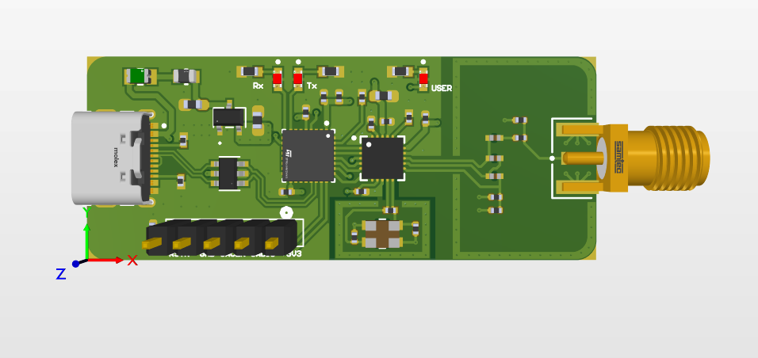
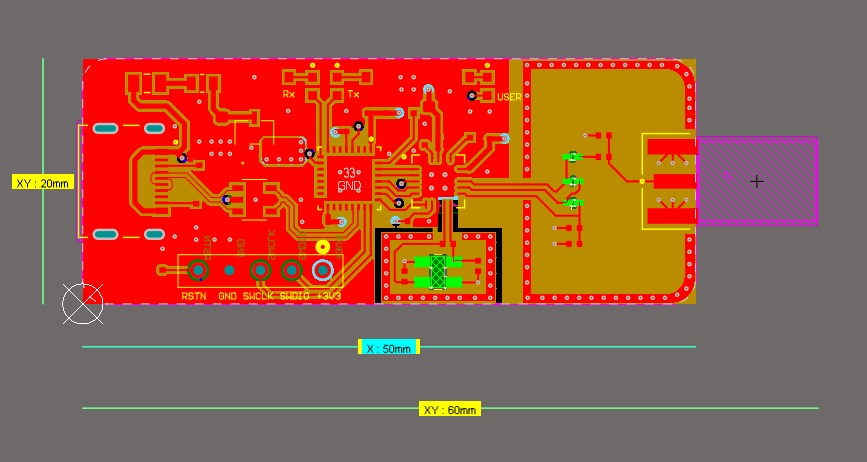

# STM32L432KBU 2.4GHz RF Dongle USB Type-C

An open-source, ultra-compact RF development dongle featuring an **STM32L432KBU** microcontroller paired with a **Nordic Semiconductor nRF24L01** 2.4GHz wireless transceiver and a USB-C port. 

> ⚠️ **Status: Work in Progress / Untested.** This design is currently undergoing community review and has not yet been physically fabricated or validated on a test bench. Use at your own discretion.

---

## Design Previews

### 3D Render View

### PCB Layout View

---

## Technical Specifications

### Hardware Architecture
* **MCU:** STM32L432KBU6 (ARM Cortex-M4 @ 80MHz, 256KB Flash, 64KB SRAM)
* **RF Transceiver:** nRF24L01+ (2.4GHz ISM Band, GFSK modulation, up to 2Mbps data rate)
* **Interface:** Native USB 2.0 via a physical **USB Type-C Connector**
* **Visual Diagnostics:** * `PA2` linked to Dedicated Hardware TX Status LED
  * `PA3` linked to Dedicated Hardware RX Status LED
  * `PA4` linked to General Purpose User LED

### Mechanical Dimensions
* **Width:** 20 mm
* **Length:** 60 mm
* **Form Factor:** Slim USB-stick profile with an integrated PCB trace or edge-mounted antenna footprint.

---

## PCB Manufacturing & Layer Stackup

This board is designed strictly around the **JLCPCB 4-Layer Controlled Impedance Stackup (JLC04161H-3313)** using a standard **1.6mm total board thickness**. This specific pre-preg and core arrangement is critical for maintaining correct 50Ω trace impedance matching for the 2.4GHz RF front-end.

### Layer Structure

| Layer | Type | Material | Thickness | Constant ($\epsilon_r$) |
| :--- | :--- | :--- | :--- | :--- |
| **Top Layer** | Signal / Copper | Copper (1 oz) | 0.035 mm | — |
| *Prepreg* | Dielectric | **7628\*1** | 0.2104 mm | 4.4 |
| **Internal Layer 2** | Plane / GND | Copper (0.5 oz)| 0.0175 mm | — |
| *Core* | Dielectric | **Core** | 1.065 mm | 4.5 |
| **Internal Layer 3** | Signal / Power | Copper (0.5 oz)| 0.0175 mm | — |
| *Prepreg* | Dielectric | **7628\*1** | 0.2104 mm | 4.4 |
| **Bottom Layer** | Signal / Copper | Copper (1 oz) | 0.035 mm | — |

---

## Repository Structure & Usage

This repository contains **source design files only**. To ensure workspace flexibility, components are cleanly bound directly inside the project archive.

* **`/Hardware`**
  * `*.PrjPcb` - Altium Project Binder
  * `*.SchDoc` - Schematic Sheets
  * `*.PcbDoc` - PCB Layout Geometry
  * `*.SchLib` & `*.PcbLib` - Complete component library assets including 3D STEP models.

### How to Review
1. Clone this repository locally.
2. Open the `.PrjPcb` file inside Altium Designer.

### Keywords & Search Tags
STM32L432 Reference Design, nRF24L01 Schematic, USB-C Dongle Hardware, 4-Layer Controlled Impedance PCB, Altium RF Layout, JLC04161H-3313, 2.4GHz Antenna Breakout.
3. Reviewers are encouraged to verify trace geometry tolerances, decoupling capacitor loops, and RF ground pour integrity before submitting feedback via GitHub Issues.